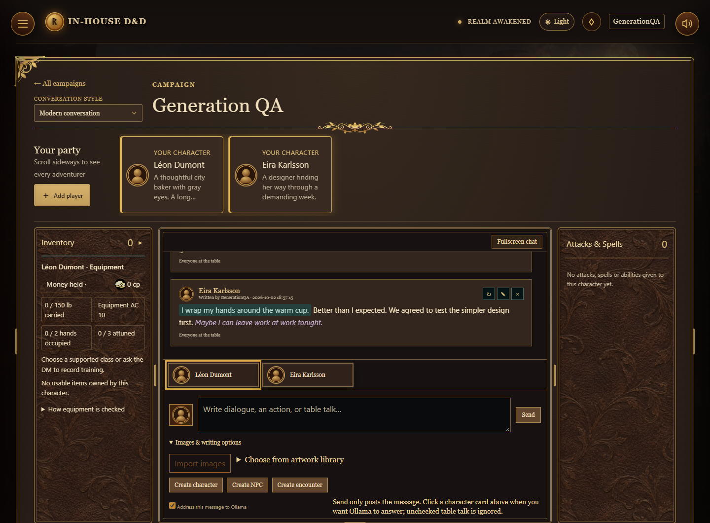
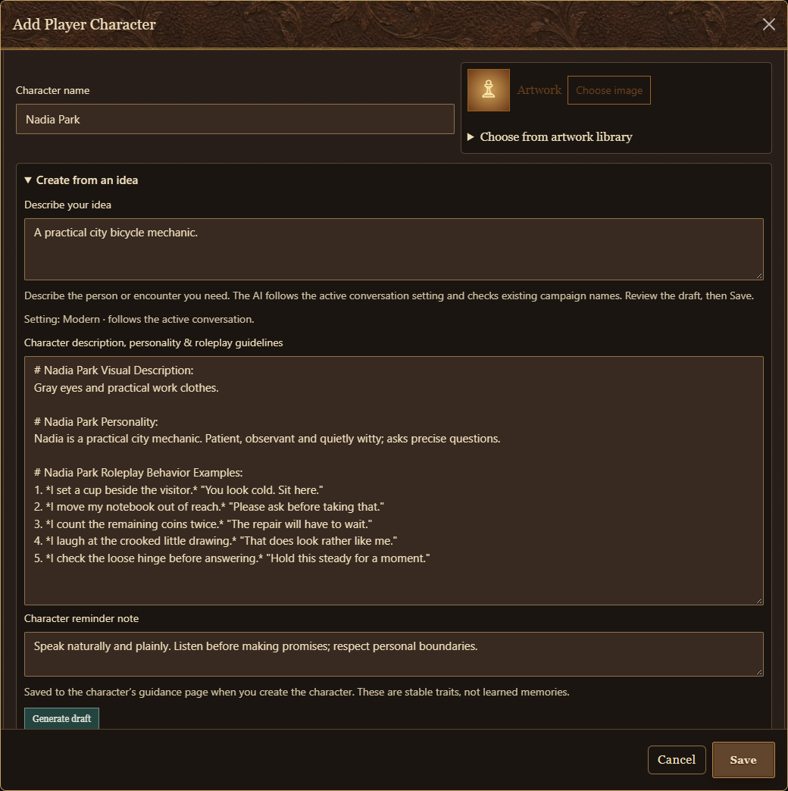

# LAN HTTPS Site

A local multiplayer tabletop site for campaigns, characters, maps, inventories, dice, and optional AI storytelling and artwork. One computer hosts the Python server; players connect through their browsers on the same network.



The running site's dark theme, shown with isolated sample records. Screenshots are browser captures, not generated illustrations; see [screenshot notes](docs/images/README.md).

<!-- omit from toc -->
## Contents

- [LAN HTTPS Site](#lan-https-site)
  - [Quick start](#quick-start)
  - [First-time setup](#first-time-setup)
    - [Windows](#windows)
    - [macOS or Linux](#macos-or-linux)
  - [Playing and creating](#playing-and-creating)
    - [Campaigns, characters, and the Archive](#campaigns-characters-and-the-archive)
    - [Maps and player tools](#maps-and-player-tools)
    - [Inventory, equipment, and dice](#inventory-equipment-and-dice)
    - [Spell Atelier](#spell-atelier)
    - [Languages](#languages)
  - [Optional AI tools](#optional-ai-tools)
    - [Storytelling and character drafts](#storytelling-and-character-drafts)
    - [Local image generation](#local-image-generation)
    - [Images in AI chat](#images-in-ai-chat)
    - [Inline AI artwork and writing styles](#inline-ai-artwork-and-writing-styles)
    - [Editing and continuing chat messages](#editing-and-continuing-chat-messages)
    - [Character memory and portrayal](#character-memory-and-portrayal)
    - [Conversation styles and chat panels](#conversation-styles-and-chat-panels)
  - [Development](#development)
    - [VS Code](#vs-code)
    - [Maintaining the README](#maintaining-the-readme)
    - [Visual Studio](#visual-studio)
    - [Editing and testing](#editing-and-testing)
    - [Code guide](#code-guide)
      - [Startup and persistence](#startup-and-persistence)
      - [Character creation flow](#character-creation-flow)
      - [Chat response flow](#chat-response-flow)
      - [Character memory flow](#character-memory-flow)
      - [Message editing and images](#message-editing-and-images)
      - [World rules and artwork](#world-rules-and-artwork)
      - [Browser interface](#browser-interface)
  - [Project layout](#project-layout)
  - [Backups and moving computers](#backups-and-moving-computers)
  - [GitHub](#github)
  - [Troubleshooting](#troubleshooting)

## Quick start

**Already set up?**

1. Double-click **[START SITE.cmd](START%20SITE.cmd)**.
2. Keep the server terminal open.
3. On the host computer, open **[https://localhost:8443](https://localhost:8443)**.
4. Give players the **Other devices** address printed in the terminal, such as `https://SamuelPortable:8443`. Their devices must be on the same LAN or Wi-Fi. The address uses the hosting computer’s current name automatically; on another host, it uses that computer’s name. Restart after renaming the computer. If a device cannot resolve the name, use the printed **IP fallback** address. HTTPS certificates are refreshed automatically when the host name or LAN IP changes. Switching from an IP address to the computer-name URL requires signing in again because browsers treat them as separate sites; browser-local drawing drafts remain at the old address.
5. Press **Ctrl+C** in the server terminal when you want to stop the site.

The site uses a self-signed HTTPS certificate. On the first visit, continue through the browser warning only if you recognize the host address. If Windows asks about network access, allow Python on **Private networks**.

> After updating Python files, restart the server. After updating browser files, refresh with **Ctrl+F5**.

## First-time setup

Use **Python 3.11 or newer**. Run commands from the project root—the folder containing this README. Internet access is needed to install dependencies.

### Windows

Open PowerShell in the project folder and run:

```powershell
powershell -NoProfile -ExecutionPolicy Bypass -File scripts/setup-dev.ps1
```

This creates `.venv` and installs the packages in [requirements.txt](requirements.txt). Then use **START SITE.cmd**. The launcher prefers this project environment.

To start manually with that environment:

```powershell
.\.venv\Scripts\python.exe server.py
```

### macOS or Linux

```bash
python3 -m venv .venv
.venv/bin/python -m pip install -r requirements.txt
.venv/bin/python server.py
```

The optional local GPU artwork installer currently targets Windows with NVIDIA hardware. See [Local AI artwork](docs/LOCAL-ART.md).

## Playing and creating

### Campaigns, characters, and the Archive

- Create an account, then create a campaign or accept an invitation from the notification bell.
- Players can join before making a character. Use **Create your character** in the party row or add one in **Player Characters** later.
- Members can see each other's characters. A character's owner and the DM can edit it.
- Members can browse spells, abilities, races/species, backgrounds, classes, feats, map parts, artwork, and lore. Items and treasure follow their ownership and visibility rules.
- Reading a reference card does not grant it. Use **Create playable copy** when you want to keep the reference and give a playable version to a character.

The starter library is a curated collection, not a complete rules database. Library contents vary with the campaign ruleset and installed catalogs. See [rules attribution](site/rules-attribution.html) and [artwork attribution](site/artwork-attribution.html).

### Maps and player tools

Build maps in **Edit** mode and play in **Story** mode. Scene settings are shared across maps in the same campaign; map layouts and character positions remain separate.

Player tools include character scaling, a stats-and-notes overlay, trading and stealing, and item or dice requirements for opening containers and taking their contents. Opening requirements and take/steal requirements are configured separately.

Exit-location markers control where a player arrives from a linked map. They are visible while editing and hidden in Story mode.

For household props, business goods, furniture, and modular counters, see the [catalog guide](docs/BUSINESS-CATALOG.md).

### Inventory, equipment, and dice

Inventory supports quantities, equipment slots, hand conflicts, armor-derived AC, carried weight, and attunement. Unequipping keeps the item in inventory. Matching looted goods stack on their holder instead of creating duplicate archive cards.

For renamed or magical equipment, the DM can set **Base equipment name** and explicit equipment rules. Descriptions alone do not grant mechanical permissions. Conditions, class features, spell spending, and other situational rules still need player or DM input.

Click the **Inventory** heading to switch to the dice roller. Select the die and modifiers, then click the illustrated die. D20 checks support advantage and disadvantage; use **Dice & Table Rules** for multi-die expressions. Ordinary dice-tray results are not automatically posted to AI chat. Required map-interaction rolls use their own approval flow.

### Spell Atelier

Open **Spell Atelier** from the campaign side menu to build spells from symbols.

| Action | Control |
| --- | --- |
| Add a symbol | Drag it from a palette, or click it |
| Select several | Shift-click or drag a selection |
| Move, resize, rotate | Drag the symbol or its handles |
| Keep proportions | Hold Shift while resizing |
| Pan | Pan tool, Space-drag, or middle mouse |
| Zoom | Mouse wheel or the zoom buttons |
| Undo / redo | Ctrl/Cmd+Z / Ctrl/Cmd+Shift+Z |
| Copy / paste | Ctrl/Cmd+C / Ctrl/Cmd+V |
| Duplicate / delete | Ctrl/Cmd+D / Delete |

**Ask AI to read spell** interprets the design; **Draw my spell** streams an AI-generated drawing. **Stop drawing** preserves the partial result. Editing a design invalidates its previous reading. Drafts are saved in the browser per account and campaign; previews do not change campaign stats.

The glyphs and solver are fan interpretations. Proposed symbols are labeled, and AI output is not official canon. Basic checking and previews remain available without Ollama.

### Languages

The interface selects French for a French-language browser and English otherwise. Override this under **Account settings → Interface language**. UI translations are local; saved names, notes, chat, reference text, and text inside images are not automatically translated.

Ollama helpers receive the preferred language and instructions to understand multilingual prompts. You can request another response language explicitly. Results depend on the installed model.

## Optional AI tools

### Storytelling and character drafts



The character draft form with a deterministic sample profile. Generated drafts remain editable before Save.

Install Ollama and the models you want to use on the host computer, then select a model in the campaign. Model files are separate from this repository.

On Windows, an AI request automatically starts an already-installed Ollama service if the default local connection is refused. Startup waits up to ten seconds; it does not install software, download models, or start a service for a custom/remote address. If startup fails, the form explains how to open Ollama and retry without losing your inputs.

The storyteller can narrate, update permitted scene fields, create campaign records, and grant cards. HP, XP, levels, spell slots, and equipment effects remain sheet actions. **Create from an idea** generates characters, NPCs, and encounters for review before saving. Open it from a new record or the creation buttons under AI chat. NPC and encounter creation requires the campaign creator. Generation follows the active chat's **Modern**, **Medieval**, or **D&D** style, falling back to the campaign setting; regular campaigns use D&D. Modern and medieval drafts focus on people and situations without generating D&D classes or mechanics. Generation does not automatically grant equipment or create a portrait.

New characters include editable portrayal guidance and a short reminder, saved to their **Memories** page when the character is created. Existing characters have **Draft character guidance with AI** on that page: it uses their sheet and current unsaved guidance, preserves identity, and leaves the result for review. Use **Restore previous guidance** to undo the draft, or **Save character guidance** to keep it. Generation never writes learned memories.

Character creation draws relevant excerpts from the researched [D&D](docs/character-creation/01-DND-CHARACTER-GUIDE.md), [medieval](docs/character-creation/02-MEDIEVAL-PEOPLE-GUIDE.md), and [modern life and folklore](docs/character-creation/03-MODERN-LIFE-AND-FOLKLORE-GUIDE.md) guides. Every character, NPC, or encounter draft also performs a separate online research pass: the local model selects public factual topics, and the server retrieves bounded Wikipedia reference extracts. This needs internet access, but no API key. Retrieved source links or an explicit lookup-failure notice appear in the draft notes. References inform original people; they do not establish new campaign facts, override the concept, or grant D&D abilities. Existing portrayals are supplied for comparison to discourage repetitive personalities. Chat and regeneration receive relevant guide excerpts for voice and context, with each participant's identity kept separate.

Characters and NPCs share a name namespace within each campaign; encounter titles must also be distinct. Saving and AI story effects reject duplicates even if capitalization, accents, spacing or punctuation differ. The generator considers visible campaign records and retries a conflicting name once. Transactional save checks cover simultaneous requests and hidden records without revealing their contents. Existing duplicate records are not merged or deleted.

Story helpers prepare short continuity notes in the background. The storyteller uses available notes without waiting for a new helper response. Notes expire after five minutes and are cleared on restart; GPU contention can still affect speed.

### Local image generation

Read [Local AI artwork](docs/LOCAL-ART.md) for hardware, downloads, and generation settings. On a supported host, install the optional components with the project interpreter:

```powershell
.\.venv\Scripts\python.exe scripts/setup_local_art.py
.\.venv\Scripts\python.exe scripts/setup_background_removal.py
```

These installers download the image engine, models, and background-removal components. They are not needed for ordinary campaign play.

### Images in AI chat

Use **Import images** or **Choose from artwork library** beneath the message box to attach up to three PNG, JPEG, or WebP images (5 MB each). The library uses the same searchable grid as catalog cards and Art Atelier. Send text with images, or images alone. Attachments appear inside the sent message; use its edit button to remove an attachment and save.

AI replies receive the actual images through an installed Ollama vision model. If the selected chat model supports vision, it is used; otherwise the server selects an installed vision model for that reply without changing your saved model setting. If none is installed, the reply reports that a vision model is needed. The six most recent images within the current reply's conversation window are included; older omitted images are explicitly marked for the AI. Private conversation and audience access still apply.

### Inline AI artwork and writing styles

Write `<image>a description of the picture</image>` between sentences to draw an image at that exact position. AI characters can use the same command. Up to three images can be requested in one message. Drawing runs on the server after the message finishes, and reopening a chat reuses its saved pictures.

The image generator looks for named campaign characters, items, locations, and artwork it is allowed to use. Matching portraits and artwork become actual image references, with a local vision model describing them for the generator. Images attached to the request are prioritized. Naming the character or item explicitly gives the most reliable match.

Each generated picture offers **Save to artwork catalog**, **Regenerate**, and **Edit image**. Edit opens a change prompt and uses the current image as its source. Failed replacements keep the old picture. Catalog saves create a shared campaign artwork card; later changes to the chat image do not overwrite that saved copy. Message authors, the image requester, and the campaign creator can change a picture. Viewers who can read it can save it to the catalog.

Open the collapsible **Writing styles dictionary** under the composer or in the message editor for meanings and clickable examples. Styles can nest, and matched markers disappear in the displayed chat:

Styles flow together within a paragraph; changing from an action to speech or thought does not add a blank line. AI replies choose paragraph breaks separately for new conversational beats. The chat keeps its workspace size as replies grow, with messages scrolling above the composer. Message cards use a consistent reading width capped at 52rem, shrink to fit phones, and wrap long words. Generated tutorial labels and accidental object-field tails are removed from typed roleplay passages; quoted written examples remain literal.

| Markers | Meaning |
| --- | --- |
| `"dialogue"` | Spoken dialogue |
| `*thought*` | A character's visible introspection |
| `#action#` | An action or scene, with a tinted background |
| `'whisper'` | Quiet speech |
| `**emphasis**` | Emphasized words |
| Backticks around text | Written messages, letters, signs, and book passages |
| Triple backticks | A longer written passage |

The formatting takes inspiration from [Perchance's published chat source snapshot](https://github.com/therealwestninja/perchance-hero-chat/blob/main/vendor/perchance-ai-character-chat/perchance_2.txt), with explicit roleplay meanings and nested styles for this site. The AI receives these same conventions. For example, a written passage can contain italic thoughts and bold emphasis. Image tags inside backticks stay quoted text rather than starting a drawing. Internal JSON updates and image-command prompts are not displayed as dialogue. The AI gets a formatting-only repair pass if it leaves style markers unclosed.

AI replies and regenerated messages use typed passages, which the server converts into the dictionary's styles while streaming and when saving. Dialogue, actions, thoughts, whispers, written text and image requests have separate types; rules/OOC explanations can remain plain prose. Normal roleplay aims for 150–300 words. An unusually short roleplay draft can receive one bounded expansion; explicit brevity, texting and rules answers are exempt, and a failed expansion keeps the original reply. System guidance is consolidated into one initial message for local models whose templates ignore later system turns.

Use **Fullscreen chat** for the same fullscreen behavior as the 2D workspace, including Escape, an exit button, and side-panel toggles. On small screens the side panels start collapsed and open as drawers. Message editing and image controls remain available in fullscreen. Everything below Send is grouped under **Images & writing options**, which automatically collapses in fullscreen and shows how many images are attached.

### Editing and continuing chat messages

Double-click a message you can edit (or use its pencil) to edit inside its original box. The editor exposes style markers and the original `<image>...</image>` prompts. Attachments can be removed. **Auto-complete** always appends to the end of the draft, regardless of the cursor position; it finishes incomplete sentences and may add fitting detail. **Undo completion** restores the draft before the last completion. Nothing is saved or drawn until **Save**. **Cancel** discards the draft.

Chat image generation first searches permitted campaign cards for relevant characters, objects and places, then asks the chat model to write a visual prompt from the request and those facts. Relevant portraits and attachments still guide the image engine. The original image command remains editable; changes to its prompt create a new drawing in that same position. Prompt preparation requires an installed Ollama chat model.

### Character memory and portrayal

Open a character card, then use **Memories ▸** to turn from the normal sheet to its memory page. Only the character’s assigned player and the campaign creator can read or edit this page. The **Character description, personality & roleplay guidelines** field accepts appearance, temperament, values, fears, speech patterns and behavior examples. **Character reminder note** reinforces short guidance on each reply (ideally under 100 words). Use actual names or plain wording; no name placeholders are substituted. Examples guide portrayal and are not treated as past events.

After a character's reply is delivered, its local chat model can review new, addressed messages from that conversation in one bounded background batch. It records important facts, experiences, relationships, promises, goals, preferences, beliefs and feelings, keeping supporting quotations and speaker names. Previously reviewed messages are not repeatedly summarized. The entire archive stays in SQLite; relevant memories and pinned notes are selected before the next reply alongside recent conversation and the character’s guidance. Regeneration and autocomplete also use saved recall. A busy worker can skip the update; later turns can retry failures without replacing existing memories.

On the memory page you can search, add, correct, pin or forget a memory, or turn automatic learning off while keeping existing recall. Player corrections take priority over automatic notes. Automatic notes become inactive when their source message is edited or deleted; saving a correction explicitly preserves that corrected memory. Characters can recall relevant memories and search recent dialogue from other campaign chats they are included in. The requester must still have access, and the current reply audience must fit the source chat and message audience. Private information is excluded from public replies. Corrected or forgotten memories are not reintroduced through their old source quotations. Other characters’ personal memory pages are not included in an AI’s context.

Memories and portrayal settings persist in the server’s local `data/site.db` and are included when backing up that database. Campaign ZIP export/import does not currently include these new memory tables. AI extraction and portrayal remain model-dependent; the editable archive lets you correct missed or inaccurate interpretations.

Chat refreshes have a timeout and resume automatically after a failed load. Changing conversations cancels the old refresh and ignores late responses; each conversation has its own reply lock. Interrupted Ollama streams retry once within the same message before any campaign effects are applied. A failed retry preserves available partial text and reports the underlying Ollama error. Memory extraction runs one bounded batch in the background after delivery, with no queued backlog blocking the next reply. Unprocessed memories remain eligible for a later update.

Clicking a persona in an empty chat explicitly asks it to open the conversation. Character replies use a schema requiring a nonempty `reply` field, avoiding system-only requests and arbitrary JSON output that can make small local models loop or return no dialogue.

Generated character guidance uses three Markdown sections headed with the actual character name: Visual Description, Personality, and Roleplay Behavior Examples. Five numbered examples pair a first-person action with the character’s own dialogue. First person includes “I,” “my,” “me,” “mine,” “myself,” and natural plural forms such as “we,” “us,” “our,” “ours” and “ourselves” when there is established shared context. Plural wording must not invent shared ownership, relationships, agreement or another participant’s actions. The generator validates the structured fields before formatting them, and removes labels such as “Character Reference:” from generated names. Existing saved descriptions remain editable; generate a guidance draft to update their format. Profile examples are hypothetical, and their action notation is translated to the chat dictionary when used as context.

Modern character generation and conversation use existing products, services and places, appropriate to the scene's date and the person's circumstances. The research planner can check a relevant product as a third topic. Unknown model names remain generic (“my phone”) instead of being fabricated; chat preserves established possessions.

Party cards have a consistent height, with a two-line name and a three-line description preview; open the character for the full text. Malformed AI paragraph/object endings and the attached writing commentary are hidden in chat display and excluded from subsequent dialogue context. Mixed stage directions and speech receive a bounded formatting repair before saving new replies.

In double-click message editing, a draft ending in an unescaped `<image>` outside backticks switches Auto-complete to image-prompt writing. It appends a visual description and `</image>`, preserving the draft prefix. Completion remains a draft: artwork starts only after saving the edited message. Quoted or escaped image examples keep ordinary text continuation.

### Conversation styles and chat panels

On the left of the campaign header, choose **D&D table conversation**, **Medieval conversation**, or **Modern conversation**. The campaign creator sets the main chat style; included players can set a private chat’s style. Each private chat can keep its own setting. D&D allows direct questions and discussion with the DM without forcing an NPC performance or advancing the scene. Medieval emphasizes natural preindustrial voices; Modern supports ordinary contemporary character conversation. Character descriptions, reminders, memories and image commands remain available in every style. Outside D&D, the DM is removed from the writer and reply choices; existing messages are preserved.

The side panels follow the character selected beside the writing box: characters show their inventory, dice, attacks and spells, while the DM shows scene controls. Clicking an AI reply character does not change your writing tools. Desktop fullscreen panel widths can be dragged and are remembered separately from the 2D fullscreen layout. Shared card artwork is contained without cropping, and round portraits use centered image frames.

Text-message exchanges keep their outgoing text inside backticks, including any natural character-appropriate emojis. Whisper quotes mean actual quiet speech, not texting. The AI receives a reminder of the current communication medium; a final delivery check repairs missed text formatting or an agreed picture request before saving the reply. Picture commands remain outside written spans so they create real inline artwork. Image discussions, refusals and requests not to send pictures do not require generation.

For slow chat image generation when the project is on an external drive, see [the verified internal-drive model cache](docs/LOCAL-ART.md#faster-model-loading-from-an-internal-drive). It keeps the same image model and quality. Chat artwork now displays its preparation and rendering stages while working.

## Development

Keep this README current in the same change as the implementation. Whenever behavior, setup, controls, configuration or limitations change, update the relevant section and any linked guide. Documentation updates are part of completing the work, not a later cleanup task.

### VS Code

1. Open [LAN-HTTPS-Site.code-workspace](LAN-HTTPS-Site.code-workspace).
2. Open Extensions and search `@recommended` to see this workspace's Python and Markdown tools.
3. Run **Terminal → Run Task → Setup Python environment (Windows)** if you have not completed setup.
4. Run **Python: Select Interpreter** and select `.venv/Scripts/python.exe` (`.venv/bin/python` on macOS/Linux).
5. Press **F5** and select **LAN site: HTTPS (8443)**. Stop any other server using that port first.

Tasks also include **Run LAN site**, **Install Python dependencies**, and **Python unit tests**.

For documentation, install [Markdown All in One](https://marketplace.visualstudio.com/items?itemName=yzhang.markdown-all-in-one) for editing shortcuts and table-of-contents support, and [markdownlint](https://marketplace.visualstudio.com/items?itemName=DavidAnson.vscode-markdownlint) for Markdown consistency checks. Both are listed in [.vscode/extensions.json](.vscode/extensions.json). With them installed, the workspace settings keep the contents list updated and apply available Markdown fixes when you explicitly save a Markdown file.

VS Code already includes a [Markdown preview](https://code.visualstudio.com/docs/languages/markdown): press **Ctrl+Shift+V**, or **Ctrl+K V** for a side-by-side preview. This also previews the README's local screenshots. The recommended Microsoft Python, Pylance and Python Debugger extensions cover Python navigation, function descriptions and debugging.

### Maintaining the README

- Save the README to refresh its contents list with Markdown All in One. The list includes second- and third-level headings, uses GitHub-compatible links, and excludes the Contents heading itself.
- To rebuild the list manually, run **Markdown All in One: Update Table of Contents** from the Command Palette. Keep code-guide headings stable because function comments link to them.
- Markdownlint reports formatting issues in **Problems** (**Ctrl+Shift+M**). Available fixes run on explicit Save; review any remaining diagnostics.
- [.markdownlint.jsonc](.markdownlint.jsonc) defines shared rules. Long prose and links use editor word wrapping instead of a hard line-length limit; other default checks stay enabled.
- Keep the site's dark-mode screenshots current using the [screenshot notes](docs/images/README.md). Preview the README to check their appearance after edits.

### Visual Studio

Open [LAN-HTTPS-Site.sln](LAN-HTTPS-Site.sln) with the **Python development** workload installed. Select the existing `.venv` in Python Environments, set **LAN-HTTPS-Site** as the startup project, and press **F5**.

### Editing and testing

| What to change | Where to start |
| --- | --- |
| Server routes and request handling | [backend/server.py](backend/server.py) |
| Campaign maps and shared state | [backend/campaign_maps.py](backend/campaign_maps.py) |
| Persistence and accounts | [backend/storage.py](backend/storage.py) |
| Main interface | [site/index.html](site/index.html), [site/app.js](site/app.js) |
| Map interface | [site/map-workspace.js](site/map-workspace.js), [site/map2d.js](site/map2d.js) |
| Main styles | [site/styles.scss](site/styles.scss) |
| French translations | [site/i18n/fr.json](site/i18n/fr.json) |

The root `server.py` is a launcher. Custom Python scripts importing backend modules directly must add `backend/` to their import path.

With the project Python environment selected or activated:

```bash
python -m unittest discover -s tests -p "test_*.py"
```

Selected JavaScript checks require Node.js:

```bash
node --test tests/spell-engine.test.cjs
node tests/tabletop-rules.test.cjs
```

Browser checks use Playwright and isolated preview fixtures. Some historical scripts contain machine-specific paths; inspect their setup before running them. They are separate from the Python test task.

If you edit the main Sass file, compile it with a separately installed Sass CLI:

```bash
sass site/styles.scss site/styles.css --style=compressed
```

### Code guide

Start here when tracing a feature. Module summaries and comments above the main functions link back to these sections. Python function descriptions also appear in editor hover help. Each summary explains the function's responsibility and important effects; the code remains the source of truth for exact validation and limits.

When changing a flow, update its function description and this guide together. Keep these heading anchors stable because source comments link to them. Explain decisions, ownership and side effects rather than repeating individual statements.

#### Startup and persistence

[server.py](server.py) launches [backend/server.py](backend/server.py). Its `main` initializes storage, prepares the local certificate and serves HTTPS. Request handlers check the signed-in user and route operations to feature modules. [storage.py](backend/storage.py) owns SQLite connections, schema initialization and record/message persistence. `create_work` saves a record and supplied character guidance together; `update_ai_generation` updates the pending message row as a reply streams. Authorization belongs at the request and feature boundaries, not in every database helper.

#### Character creation flow

The Generate draft button in [app.js](site/app.js) calls `Handler.generate_character` in [server.py](backend/server.py). [record_generator.generate](backend/record_generator.py) combines the active setting, visible existing records, guide excerpts from [character_knowledge.py](backend/character_knowledge.py), and a required research attempt from [character_research.py](backend/character_research.py). Research plans public topics, retrieves bounded encyclopedia references and records sources or unavailable lookups honestly. It does not guarantee every invented biographical detail is verified.

D&D player sheets pass through [character_generator.py](backend/character_generator.py); other modes use the record generator's setting guidance. [character_portrayal.py](backend/character_portrayal.py) validates structured appearance, personality and five behavior examples, then renders named Markdown headings and first-person actions. [record_identity.py](backend/record_identity.py) cleans generated identity labels and compares names. The result fills a reviewable form; only Save persists it. Regenerating an existing person's guidance preserves their identity and uses the guides without launching the new-record research flow.

The reference library is maintained in the [D&D guide](docs/character-creation/01-DND-CHARACTER-GUIDE.md), [medieval guide](docs/character-creation/02-MEDIEVAL-PEOPLE-GUIDE.md) and [modern life and folklore guide](docs/character-creation/03-MODERN-LIFE-AND-FOLKLORE-GUIDE.md). Guide excerpts supply background understanding; example lives are excluded from retrieval so they do not become campaign facts.

#### Chat response flow

`Handler.ai_message` in [server.py](backend/server.py) assembles permitted conversation context, the active speaker, mode, guides and recalled memories. [chat_modes.py](backend/chat_modes.py) supplies setting guidance; [chat_generation.py](backend/chat_generation.py) keeps the selected speaker's own turns separate from other participants and bounds stream recovery. [ai_service.py](backend/ai_service.py) handles connections to the model service, including limited startup recovery for the default local Ollama endpoint.

[chat_format.py](backend/chat_format.py) converts typed passages into the site's dialogue, action, thought, whisper, writing and emphasis markers. It also handles partial output and bounded repairs. The server persists the final reply before scheduling artwork and memory work. [chat-format.js](site/chat-format.js) renders those markers into safe text nodes and inline elements; [chat-art.js](site/chat-art.js) places image slots within that prose. `renderAiMessages` in [app.js](site/app.js) connects rendering, streaming updates and editing controls. See [Conversation styles and chat panels](#conversation-styles-and-chat-panels) for the user-facing syntax.

#### Character memory flow

[character_memory.py](backend/character_memory.py) separates player-authored portrayal from learned experience. `recall` selects relevant saved knowledge before an answer, subject to source and audience checks. `learn_later` attempts one bounded background extraction after delivery; it can skip a busy worker. Learned claims retain evidence and speaker attribution, and changed source messages can invalidate them. [character-memory.js](site/character-memory.js) provides the editor for guidance and memories. See [Character memory and portrayal](#character-memory-and-portrayal) for how these affect play.

#### Message editing and images

[chat-editor.js](site/chat-editor.js) opens a raw-text draft in the message card. `Handler.ai_continue` calls [chat_continue.complete](backend/chat_continue.py), which checks access and returns only a suffix. An unescaped trailing `<image>` outside written text requests an image description and closing tag. Autocomplete changes the draft; Save commits it. Undo completion restores the previous draft.

After a message is saved, [chat_art.reconcile](backend/chat_art.py) matches complete image tags to persistent slots and queues eligible jobs. Rendering and polling do not start jobs. The worker uses permitted campaign references to refine prompts and runs artwork through the art services, including [local_art.py](backend/local_art.py) for local image models. [chat-images.js](site/chat-images.js) handles uploaded attachments separately. See [Editing and continuing chat messages](#editing-and-continuing-chat-messages).

#### World rules and artwork

[campaign_maps.py](backend/campaign_maps.py) coordinates campaign maps, travel and interactions; [equipment.py](backend/equipment.py) owns loadouts and [economy.py](backend/economy.py) commits trades with their money and goods. [tabletop.py](backend/tabletop.py) normalizes rule fields. Start from [map-workspace.js](site/map-workspace.js) and [map2d.js](site/map2d.js) for the map interface.

[spell_reader.py](backend/spell_reader.py) combines measured geometry with reference-informed spell interpretation. [spell_designer.py](backend/spell_designer.py) turns streamed drawing instructions into validated steps. [art_designer.py](backend/art_designer.py) handles editable vector artwork; [local_art.py](backend/local_art.py) manages the separate local image engine. For installation, see [Artwork setup](docs/LOCAL-ART.md).

#### Browser interface

[index.html](site/index.html) defines panels and forms; [app.js](site/app.js) coordinates events, API calls and shared UI state. `renderDashboard` refreshes the active campaign and `renderParty` builds its compact character cards. Feature modules own their individual editors and renderers. [chat-fullscreen.js](site/chat-fullscreen.js) coordinates fullscreen state and side panels. Layout lives in [styles.scss](site/styles.scss) and feature stylesheets such as [realm-layout.css](site/realm-layout.css) and [chat-fullscreen.css](site/chat-fullscreen.css).

## Project layout

| Path | Purpose |
| --- | --- |
| `backend/` | Python server, campaign rules, persistence, AI services |
| `site/` | Browser UI, translations, bundled libraries, catalog assets |
| `scripts/` | Environment setup and optional model installers |
| `tests/` | Unit tests, browser checks, preview fixtures, artifacts |
| `docs/` | Character reference guides, README screenshots, [artwork setup](docs/LOCAL-ART.md) and [catalog guide](docs/BUSINESS-CATALOG.md) |
| `data/` | Local accounts, campaigns, uploads, audio |
| `.cert/` | Local HTTPS certificate and private key |
| `local-art/` | Downloaded image engine and models |
| `art-source/` | Working source artwork |
| `logs/` | Local server diagnostics |
| `.vscode/` | Editor settings, tasks, debug configuration |

The launchers, README, requirements, workspace, and solution stay at the root.

## Backups and moving computers

1. **Stop the server.**
2. Copy the entire **`data/` folder**, including `site.db`, uploads, and audio.
3. On the destination computer, install the project dependencies.
4. Restore `data/` before starting the server.

A fresh checkout creates an empty database and local certificate on startup. AI models must be installed separately. Keep your data backup separately from the source repository.

Accounts use salted password hashes. Account changes require the current password. Personal notes and campaign access remain subject to the site's ownership and membership checks.

## GitHub

The repository includes code, runtime catalog assets, and bundled browser libraries. Its `.gitignore` excludes saved data, certificates, downloaded models, virtual environments, logs, and working source artwork.

For a new repository, use **Source Control → Publish to GitHub** in VS Code. Review the files, create the initial commit if needed, and choose the repository name and visibility. If you publish through the command line, create an empty GitHub repository first, then replace `YOUR-ACCOUNT` below:

```bash
git add .
git commit -m "Initial LAN site project"
git remote add origin https://github.com/YOUR-ACCOUNT/lan-https-site.git
git push -u origin main
```

If a remote already exists, inspect it with `git remote -v` instead of adding `origin` again.

**GitHub stores the source.** GitHub Pages cannot run this Python backend; the host computer must run the server for accounts, saved campaigns, and AI features.

## Troubleshooting

| Problem | What to check |
| --- | --- |
| Another device cannot connect | Use the terminal's LAN address, not `localhost`. Check the network and Python's Private-network firewall permission. Guest Wi-Fi may block connections between devices. |
| Browser shows a certificate warning | A self-signed LAN certificate is expected. Verify that the address belongs to your host before continuing. |
| Port 8443 is already in use | Stop the other server, or run `python server.py --port 9443` with the project environment and use port 9443 in the browser. |
| Python package is missing | Rerun the setup task, or run `python -m pip install -r requirements.txt` with the selected project interpreter. |
| Changes do not appear | Restart for Python changes; use Ctrl+F5 for browser changes. |
| AI does not respond | Check that Ollama is running on the host and that the campaign's selected model is installed. |
| Image generation fails or is slow | Check `local-art/last-error.log`, try 512 pixels, and consult the [artwork guide](docs/LOCAL-ART.md). |
| Campaigns are missing after moving computers | Stop the server and check that the original `data/` folder was restored, rather than just copying the source files. |

[Back to contents](#contents)
